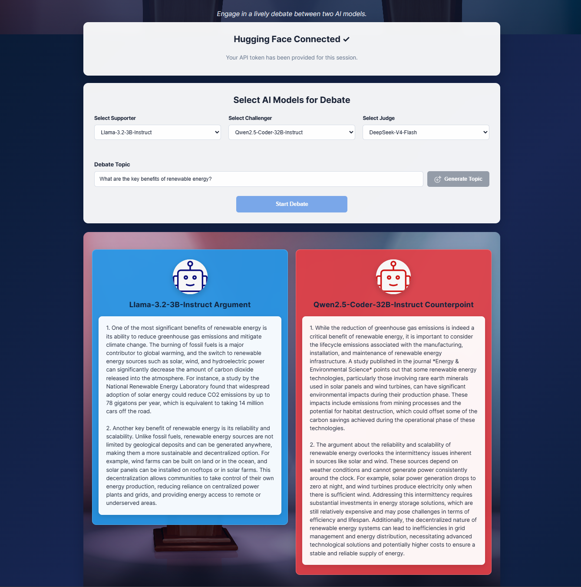
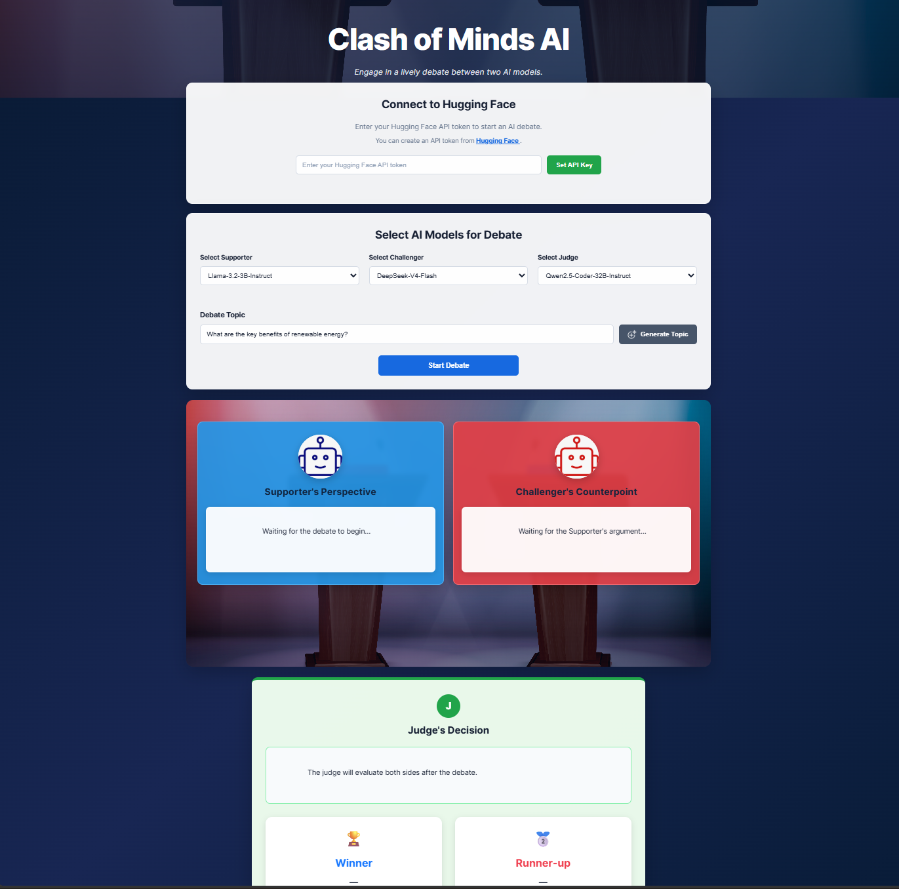
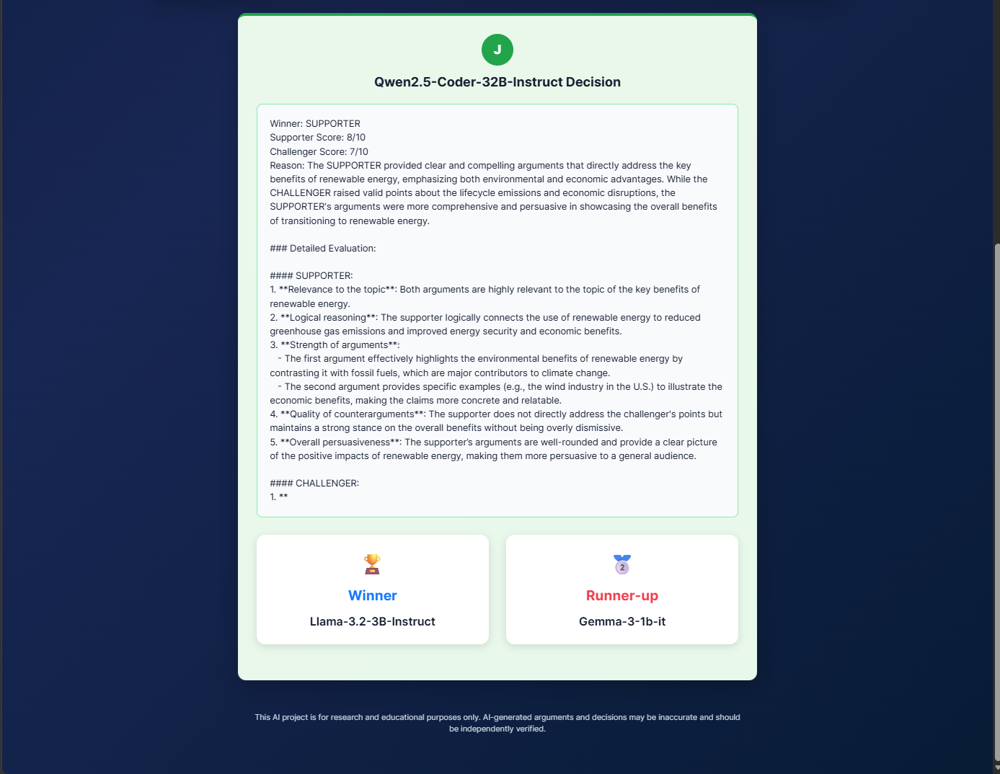

# Clash of Minds AI

A multi-agent AI debate platform where independent Large Language Models (LLMs) act as a Supporter, Challenger, and Judge to autonomously conduct and evaluate a debate.

## Live Demo

[Try Clash of Minds AI](https://clash-of-minds-ai.onrender.com/)

## Overview

Clash of Minds AI demonstrates a multi-agent LLM workflow in which multiple AI models collaborate through different specialised roles.

The system separates the debate process into three AI agents:

- **Supporter AI** — constructs arguments in favour of the selected position.
- **Challenger AI** — analyses the Supporter's argument and generates a counterargument.
- **Judge AI** — evaluates both sides and determines the winner and runner-up.

Users can independently select the model used for each role, enter a debate topic, or generate a topic using AI. The application then orchestrates the complete debate workflow through the web interface.

## Key Technical Highlights

- Designed a **multi-agent LLM architecture** with specialised AI roles.
- Integrated the **Hugging Face Inference API** using its OpenAI-compatible chat completion endpoint.
- Implemented **dynamic model selection** for Supporter, Challenger, and Judge agents.
- Built an automated **argument → counterargument → evaluation** workflow.
- Implemented structured AI-based **winner and runner-up evaluation**.
- Added AI-powered **debate topic generation**.
- Developed a responsive frontend using **HTML5, CSS3, and JavaScript**.
- Implemented client-side API interaction and asynchronous AI requests.
- Deployed the application as a **live web application using Render**.

## How It Works

```text
                    Debate Topic
                         |
                         v
                +----------------+
                |  Supporter AI  |
                +-------+--------+
                        |
                        | Argument
                        v
                +----------------+
                | Challenger AI  |
                +-------+--------+
                        |
                        | Counterargument
                        v
                +----------------+
                |    Judge AI    |
                +-------+--------+
                        |
                        v
              Winner / Runner-up
```

## Technology Stack

**Frontend**
- HTML5
- CSS3
- JavaScript (ES6+)

**AI / APIs**
- Hugging Face Inference API
- OpenAI-compatible Chat Completions API
- Large Language Models (LLMs)

**Deployment & Tools**
- Git
- GitHub
- Render
- Visual Studio Code

## AI Integration

The application uses the Hugging Face Inference API through its OpenAI-compatible chat completion endpoint.

Different AI models can be assigned to the Supporter, Challenger, and Judge roles, allowing different AI agents to participate in the debate and evaluation process.

## Getting Started

### Prerequisites

- A modern web browser
- A Hugging Face account and API token
- Visual Studio Code
- Live Server extension for Visual Studio Code

### Run Locally

1. Clone the repository:

```bash
git clone https://github.com/MOHAMEDAfrath/clash-of-minds-ai.git
cd clash-of-minds-ai
```

2. Open the project folder in Visual Studio Code.

3. Install the **Live Server** extension if you don't already have it.

4. Right-click `index.html` and select **Open with Live Server**.

5. Open the application in your browser.

6. Enter your Hugging Face API token in the application's API configuration section.

7. Select the AI models for:
   - Supporter AI
   - Challenger AI
   - Judge AI

8. Enter a debate topic or generate one using AI.

9. Click **Start Debate**.

> **Security:** Never hard-code your Hugging Face API token into the source code or commit it to GitHub.

## Debate Workflow

1. A debate topic is provided or generated.
2. The Supporter AI generates an argument.
3. The Challenger AI generates a counterargument.
4. The Judge AI evaluates both arguments.
5. The Judge determines the winning side.
6. The application displays the winner and runner-up.

## Project Structure

```text
clash-of-minds-ai/
│
├── assets/
│   ├── images/
│   │   ├── add-topic.png
│   │   ├── bot-blue.jpeg
│   │   ├── bot-red.jpeg
│   │   └── debate-background.jpg
│   │
│   └── screenshots/
│       ├── ai-debate.png
│       ├── final-results.png
│       └── main-interface.png
│
├── css/
│   └── style.css
│
├── js/
│   └── app.js
│
├── .gitignore
├── index.html
└── README.md
```

## Screenshots

### Main Interface



### AI Debate



### Final Result



## Future Improvements

Potential future improvements include:

- Secure backend API for API-key handling
- Debate history and persistence
- User authentication
- Debate scoring and analytics
- Additional AI model providers
- Advanced evaluation criteria
- Debate replay functionality
- Cloud deployment

## Deployment

The application is deployed as a static web application using Render.

**Live Application:**  
https://clash-of-minds-ai.onrender.com/

The frontend communicates with the Hugging Face Inference API to generate debate topics, arguments, counterarguments, and evaluations.

> **Note:** Users provide their own Hugging Face API token through the application. No personal API credentials are stored in the repository.

## Author

**Mohamed Afrath Segu Mohamed**

Software Developer | AI & Full-Stack Development

[GitHub](https://github.com/MOHAMEDAfrath)

